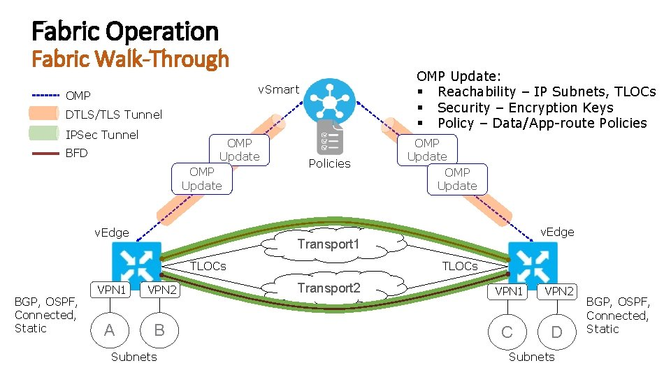
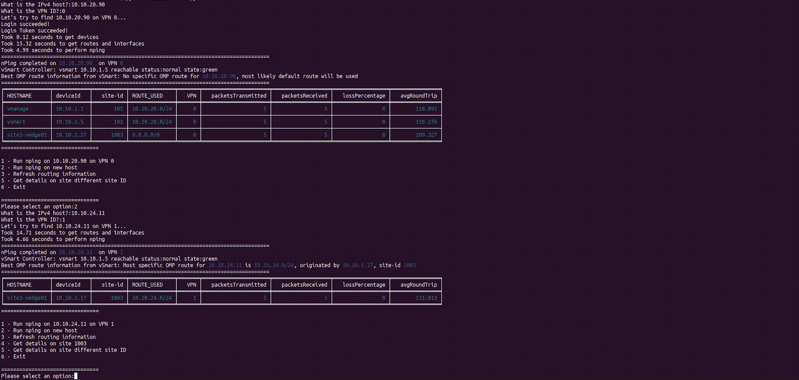
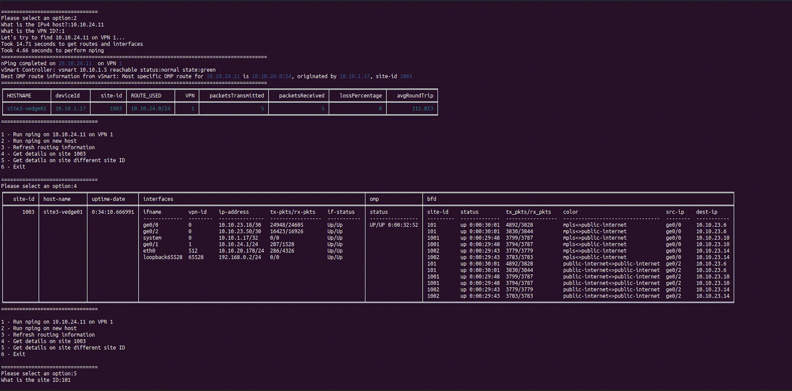
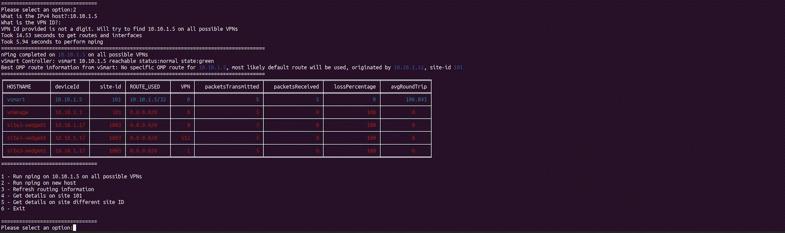

# Troubleshooting Toolkit for Cisco SD-WAN

This python script interacts with the Cisco SD-WAN vManage REST API, to perform network troubleshooting programmatically.
Having a host IPv4 address as a starting point, this script attempts to:
- Locate which site ID the host was originated, using OMP prefixes the controller received;
- Managed devices (i.e.: vEdges, cEdges) generate ICMP packets using nPing to confirm reachability towards the target host;
- Gather operational details, such as interface, omp, or bfd, of managed devices of the site;



The idea is to have a CLI tool able to provide as many operational details as output, with minimal information as input, such as an IP or site ID.
The interaction with the tool is menu-based and each option is either method or collective methods. This makes it modular, so more functions can be added to the tool if needed. For example, interacting with DDI for more information on the IP.

## API used for this project
| Method | API path |
| --- | --- |
| `POST` | `/j_security_check` |
| `GET` | `/dataservice/client/token` |
| `GET` | `/dataservice/device/interface` |
| `GET` | `/dataservice/device/omp/summary` |
| `GET` | `/dataservice/device/omp/routes/received` |
| `GET` | `/dataservice/device/bfd/sessions` |
| `GET` | `/dataservice/device/tunnel/statistics` |
| `GET` | `/dataservice/device/ip/routetable` |
| `POST` | `/dataservice/device/tools/nping` |

For more information on available [Cisco SD-WAN vManage APIs](https://developer.cisco.com/docs/sdwan/#!sd-wan-vmanage-v20-4):

### Requirements
```
git clone https://github.com/sbarissonmez/sdwan-tshoot-tool
cd sdwan-tshoot-tool
pip install -r requirements.txt
```

### Sample Outputs







